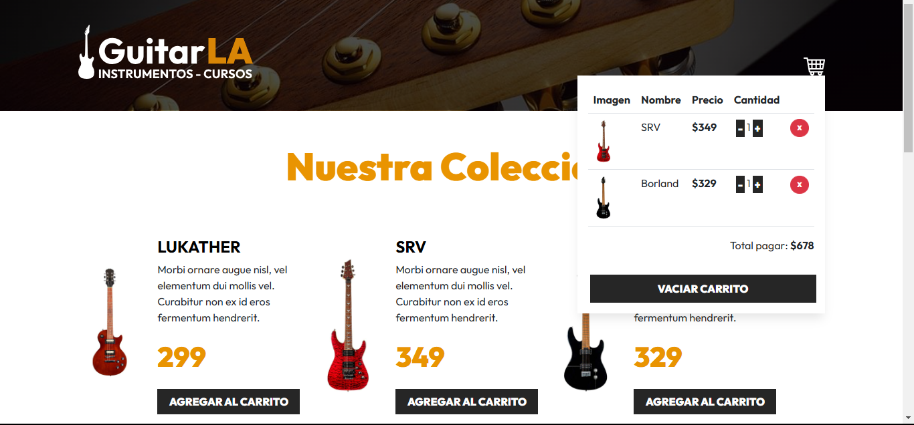

# GuitarLa

**GuitarLa** es una aplicación web desarrollada con **React, TypeScript, Tailwind CSS y localStorage** que permite a los usuarios explorar y adquirir guitarras. Durante su desarrollo, profundicé en la gestión del State utilizando **useState** y **useEffect** para manejar el carrito de compras. Aprendí a dividir la interfaz en componentes reutilizables y modulares, y a implementar la persistencia de datos con localStorage, manteniendo el carrito entre recargas. 

## Demo 🚀

👉[Prueba el carrito en vivo aquí](https://harmonious-meringue-e82cf1.netlify.app/)

## Screenshots

## Main Features ✨

- **Catálogo de guitarras:**: Explora una variedad de guitarras, cada una representada como un componente individual con su propia información (nombre, descripción y precio).
- **Carrito de compras dinámico**: 
  - *Agregar guitarras*: Los usuarios pueden añadir guitarras al carrito con solo un clic.
  - *Actualizar cantidades*: Es posible incrementar o reducir la cantidad de guitarras en el carrito.
  - *Eliminar productos*: Los usuarios pueden eliminar productos específicos del carrito de compras.
  - *Cálculo automático*: El total a pagar se actualiza dinámicamente a medida que el contenido del carrito cambia.
- **Persistencia con localStorage**

## What I learned with this project 📚
### Technologies used 

**Client:** React, TailwindCSS

**Server:** TypeScript, Vite, Custom Hooks, State Management, Local Storage

### Application optimization:

- State Management en React
- Componentización
- Persistencia de datos
- Renderizado eficiente

### Focus on best practices:

- Implementación modular y reutilizable de componentes.
- Aplicación de principios de State Management para controlar el estado del carrito de compras.
